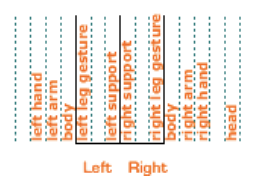

# Labanotation choreography visualization
Analyzing and visualizing choreography as visual signatures.

[Checkout the information page.](https://laurasher.github.io/labanotation/)

Digital data archive of notated dance scores from the [Dance Notation Bureau](http://www.dancenotation.org/library/frame0.html).

Read notations (roughly) using below guide .